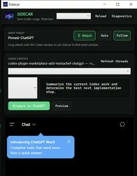
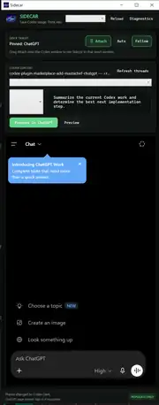

# Sidecar

**Preserve precious Codex usage by offloading planning, debugging, code review, and repository analysis to ChatGPT—then return the finished work to Codex as a detailed implementation handoff.**

Sidecar is a native Windows companion for the ChatGPT/Codex desktop app. It stays put until you manually attach it to the exact Codex window you choose, reads a selected saved Codex conversation and bounded repository context locally, and prepares that context inside an embedded ChatGPT session without submitting another prompt to the Codex thread.

> **Current release: v0.8.1-alpha.6**

## Screenshots

<p align="center">
  
</p>

<p align="center"><em>Codex context selection, request controls, preview, ChatGPT preparation, and the embedded ChatGPT workspace.</em></p>

<p align="center">
  
</p>

<p align="center"><em>Full Sidecar companion window in a dark Codex-style theme.</em></p>

## The workflow

```text
Codex context → Sidecar/ChatGPT planning → detailed Codex handoff → Codex implementation
```

1. Open the Codex project and conversation you are working on.
2. Run `Sidecar.exe` and sign into ChatGPT inside Sidecar.
3. Drag **Attach** over the exact Codex window and release.
4. Select the correct saved root Codex thread.
5. Enter a Plan, Debug, Review, or General request.
6. Select **Preview**, then **Prepare in ChatGPT**, review the populated message, and send it.
7. After the ChatGPT work is complete, select **Prepare handoff**.
8. Send the handoff request in ChatGPT.
9. When ChatGPT finishes, select **Copy latest reply** and paste that detailed prompt into Codex.

Sidecar populates prompts but does **not** auto-submit them.

## Current features

- **Manual-only docking:** Sidecar never guesses or auto-selects a window. It moves only after you drag **Attach** onto a specific window.
- **Persistent ChatGPT session:** sign in once through the embedded WebView2 browser.
- **Codex context reader:** choose recent saved root Codex conversations; subagent rollouts are excluded.
- **Repository context:** bounded Git status, staged and unstaged diffs, recent commits, instructions, manifests, and referenced files.
- **Context preview:** inspect exactly what will be placed into ChatGPT.
- **Return-to-Codex handoff:** asks ChatGPT for a self-contained implementation prompt covering decisions, files, steps, constraints, errors, tests, unresolved questions, and the next action.
- **Copy latest reply:** copies the completed ChatGPT handoff directly to the clipboard.
- **Secret protection:** excludes sensitive file categories and redacts common credentials and tokens on a best-effort basis.
- **Codex-style themes:** Codex Green, Codex Dark, Midnight, Light, and System.
- **Fully themed window chrome:** the title bar, app icon, title text, minimize/maximize/close controls, cards, dropdowns, and footer all follow the selected Sidecar theme.
- **Readable themed controls:** dropdown selections and popup items use explicit theme-aware text and backgrounds.
- **Clean Windows app:** self-contained `Sidecar.exe` using the supplied chrome-car artwork.
- **Privacy-safe diagnostics:** startup and browser diagnostics exclude conversation and repository contents.

## Download

Download the latest release from **[GitHub Releases](https://github.com/mastachef/chatgpt-sidecar/releases/latest)**.

The public release contains only:

- `Sidecar.exe`
- `README-FIRST.txt`

Put both files in a normal folder and run `Sidecar.exe`.

## Themes

Choose a theme from the Sidecar header. The choice is saved automatically and applies to the entire native Sidecar shell, including the custom title bar.

| Theme | Appearance |
|---|---|
| Codex Green | Near-black surfaces with muted terminal-green text and accents |
| Codex Dark | Neutral charcoal Codex-style interface |
| Midnight | Deep navy and violet styling inspired by the Sidecar artwork |
| Light | Bright high-contrast interface |
| System | Uses the Windows app light/dark preference |

The embedded ChatGPT page controls its own appearance separately.

## Requirements

- Windows 10 or Windows 11, 64-bit
- ChatGPT/Codex desktop app with at least one saved Codex conversation
- Microsoft Edge WebView2 Runtime
- Git available for repository status and diff collection

The release is self-contained for .NET; the .NET SDK is not required.

## Privacy and safety

Before anything is placed into ChatGPT:

- the selected Codex thread is shown explicitly
- context size is bounded
- `.env`, credential, key, dependency, build-output, traversal, and out-of-repository paths are excluded by default
- common token and credential patterns are redacted on a best-effort basis
- the complete prepared context can be previewed

Nothing is typed into the Codex composer, and Sidecar does not resume or submit to Codex threads. The return handoff is copied to the clipboard for the user to review and paste manually.

## Diagnostics

```text
Startup: %LOCALAPPDATA%\ChatGPTSidecar\Diagnostics\startup-crash.log
Runtime: %LOCALAPPDATA%\ChatGPTSidecar\Diagnostics\sidecar-dock.log
```

This is an unsigned alpha build, so SmartScreen may show a warning.

## Development

```powershell
npm test
npm run dock:test
npm run dock:publish
```

The Windows workflow builds and tests the native app, publishes a self-contained `Sidecar.exe`, verifies the embedded icon, and launches the packaged executable in startup-smoke mode before producing a release.

## License

MIT
